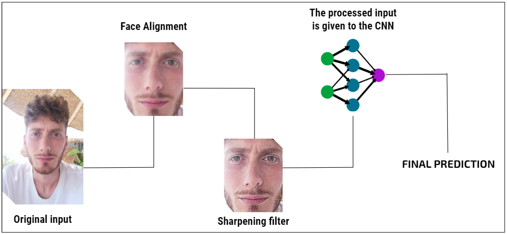
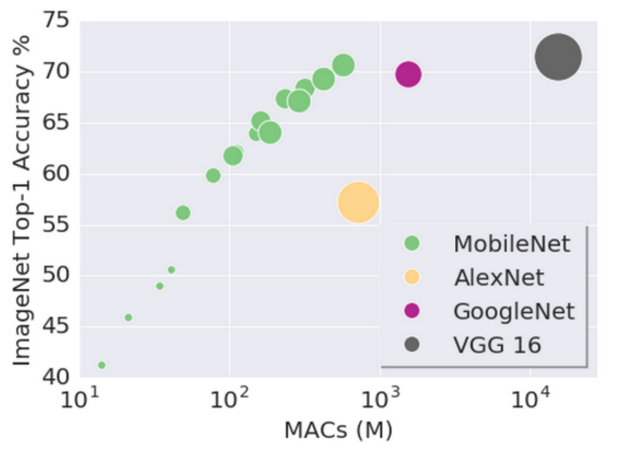

# CNN for glass detection

The model "GlassDect" developed by "Glass Detection - Team", has released the fist version on 15/06/22. It is based on the [paper](https://drive.google.com/file/d/1BDit7PxT2dFPRhPIzsDAj_fIiEDRnC77/view?usp=sharing), and its purpose is to detects and classify if a subject is wearing or not glass. The model's goal is exclusively to identify the presence of glass in a selfie image. It does not attempt to discover identities or demographics.

On this page, you can learn more about how well the model performs on images with different characteristics and what kinds of images you should expect the model to perform well or poorly on.

## Model description

The model uses a CNN trained on the Selfie Data Set, for the identification of glass in a selfie image.

The CNN used is composed by:

* 4 convolutional layers: which uses the kernels to extract the features map
* 4 max pooling layers: used to reduce the dimensionality of a feature map, to keep only the relevant information
* 2 fully connected layer
* 6 dropout layer: used to avoid overfitting
* 4 batch normalization: used to normalize a batch of training data

[comment]: <> (foto architettura)
## FOTO ARCHITETTURA

**Input**: Photo(s)

**Output**: For each input image the model outputs, will classify the if the image shows a subject wearing glass. 

No identity or demographic information is detected.

## Intended uses

The model was intended to be used to help biometric systems for facial authentication, because the presence of glass in an image could hamper the correct detection of faces due to disproportions, shadows or reflexes.
So the main intent of the model is to notify to the user to remove glass if this item is detected before the biometric authentication.

Note that this model is primarily aimed to be used on selfie images to make decisions about the presence of glass, but it can be used on all the kind of images.

## Limitations

The following factors may degrade the model’s performance:

* Multiple-subject: The model will classify only one subject
* Facial Orientation: Needs visible facial landmarks such as eyes, noses, and mouths to work correctly
* Lighting: Poorly illuminated faces might not be detected.
* Occlusion: Partially hidden or obstructed faces might not be detected
* Blur: Blurry faces might not be detected


## Performance

Here you can dig into the model's performance. As performance measure the accuracy has been chosen. The performance evaluation has been done in the fairest possible way, balancing the training set, validation set and training set with the 50% images with a subject that wears glass and 50% with a subject that not wears glass. This balancing  has been done using the data augmentation. The augmentation step has been applied only to the photos of the dataset with subject wearing glasses, in order to correctly balance the samples of the two classes. We correctly created our training and validation set, without considering photos already taken by the test set or their augmented version. The finally accuracy reached by the model using a number of example that is **25,000**, its equal to **93%**.

## Training data

Considering the main task, the main dataset used for the training of the model is the [Selfie Dataset](../data/Selfie/dataset_card_Selfie.md)


## Training Procedure

### Preprocessing

To improve the final accuracy of the model, a preprocessing has been done using the following techniques in the following order:

1. Face alignment: an alignment tool, which is widely used in tasks that work on faces. It can be seen as a form of “data normalization” and it is composed by 3 steps:
    * Center the image
    * Rotate the image such as the eyes lie is on horizontal line
    * Scale the image such that the size of the faces are approximately identical
2. Sharpening filter: used to enhance the edges of objects and adjust the contrast and the shade characteristics



## Evaluation Results

To have more reliable results, the performance of the evaluation have been done using different datasets. To perform a test that was as fair as possible we selected 10.000 samples for each dataset using 80% for training, 10% for validation and 10% for test. Each set was balanced in the best possible way by having 50% of images with subjects with glasses and 50% of images with subjects without glasses. To reach these conditions we performed an offline data augmentation (flipped, rotation and bright-
ness shifting) on the photos in which the subjects are wearing glasses, on each dataset.
Below are specified the datasets used:

* [Celeb Face Data Set](../data/CelebA/dataset_card_CelebA.md)
* [UTK Face](../data/UTK%20face/dataset_card_UTK.md)

<center>

| DATASET | ACCURACY |
|:-------:|:--------:|
|  SELFIE |   0.862  |
|  CELEBA |   0.987  |
| UTKFACE |   0.993  |
</center>

Concerning the experimental phase, we decided to compare our CNN with two very famous state-of-the-art models: VGG-16 and MobileNet. 

We would have liked to include GlassNet in the comparison, but currently it is not possible to find the complete architecture. The choice of VGG is due to the fact that this CNN is one of the best performing in the state of the art: it is made up of about 46 million parameters, a number very similar to the parameters of the reference paper. The choice of MobileNet was taken for the similar characteristics compared to our model, as it has about 3 million parameters and this feature makes it suitable for working on mobile devices.

Below are showed the performance results of all the models taken into account, with the three datasets:

<center>

|           | SELFIE | CELEBA | UTKFACE |  MEAN |
|:---------:|:------:|:------:|:-------:|:-----:|
|   VGG-16  |   0.9  |  0.984 |  0.993  | 0.959 |
| MOBILENET |  0.854 |  0.962 |  0.991  | 0.935 |
|  OUR CNN  |  0.862 |  0.974 |  0.988  | 0.939 |
</center>

### Significance Test

Since we had very close accuracy results comparing our model and the models considered for the experimentation, we decided to evaluate if there was significative difference performing a paired Student's t-test between the various models. After the test no significance difference has been discovered.

## Ethical Considerations

The following are specific ethical considerations:

* **Data**: The model doesn't any sensitive data
* **Human life**: The model is not intended to inform decisions about matters central to human life or flourishing 
* **Risks and harms**: If the model is used in a correct way, there are no risks in model usage
* **Use cases**: There are not any known model use cases that are especially
fraught

## Model Details

```bibtex
@article{DBLP:journals/corr/abs-1810-04805,
  author    = {Andrea Montemurro and
               Claudia Sgarra and
               Gaetano Dibenedetto and
               Mauro Andretta},
  title     = {{GlassDect:} CNN for Glass Detection},
  year      = {2022},
  url       = {https://drive.google.com/file/d/1BDit7PxT2dFPRhPIzsDAj_fIiEDRnC77/view?usp=sharing},
  timestamp = {Tue, 15 Jun 2022 20:39:56 +0100},
}
